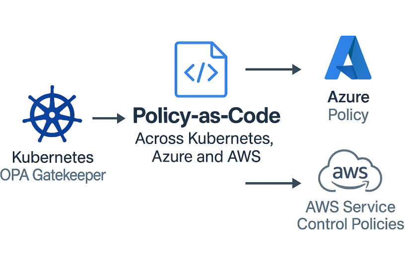

# Policy-as-Code Across Kubernetes, Azure and AWS

Demonstrating cross-cloud policy enforcement with Kubernetes (OPA Gatekeeper), Azure Policy and AWS Service Control Policies—automated and secure by design. This lab shows how to **write, apply and validate security/compliance policies** in multi-cloud and container environments, integrating automation, CI/CD and real-time policy monitoring.

---

## Table of Contents
- [Overview](#overview)
- [Real-World Risk](#real-world-risk)
- [What I Built](#what-i-built)
- [Diagram](#diagram)
- [Objectives](#objectives)
- [Steps Performed](#steps-performed)
  - [1. Environment Setup]
  - [2. OPA/Rego for Kubernetes]  
  - [3. Azure Policy with Bicep]  
  - [4. AWS Service Control Policies]  
  - [5. Bonus Extras] 
- [Screenshots](#screenshots)
- [Lessons Learned](#lessons-learned)
- [Notes and Limitations](#notes-and-limitations)
- [References](#references)
- [Contact](#contact)

---

## Overview

This lab implements **Policy-as-Code** across Kubernetes, Azure and AWS.  
The goal: enforce security and compliance rules automatically, prevent misconfigurations before deployment, and demonstrate a recruiter-ready multi-cloud security skill set.

**Core Technologies:**
- **Kubernetes** with [OPA Gatekeeper](https://open-policy-agent.github.io/gatekeeper/) for admission control.
- **Azure Policy** using [Bicep](https://learn.microsoft.com/en-us/azure/azure-resource-manager/bicep/)
- **AWS Service Control Policies** (SCP) via the AWS CLI.

**Bonuses:**
- **GitHub Actions** CI/CD for policy testing.
- **Grafana** for real-time policy violation dashboards.
- **Slack integration** for policy alerts.
- **Self-healing scripts** for auto-remediation.

---

## Real-World Risk

Without automated guardrails, cloud and container environments can drift from security baselines.  
Misconfigured Kubernetes deployments, untagged Azure resources or AWS accounts without MFA can lead to **compliance failures, security breaches, and costly incidents**.  
This lab demonstrates how to **shift left**—preventing violations before they reach production.

---

## What I Built

- **Kubernetes** policy to enforce required labels on deployments using OPA Gatekeeper.  
- **Azure Policy** (Bicep) to deny resource creation without environment tags.  
- **AWS SCP** to block all actions unless MFA is enabled.  
- **Automation** with CI/CD, Slack alerts and self-healing for missing tags or insecure settings.  
- **Unified dashboard** to view violations across platforms.

---

## Diagram

---

## Objectives

- Enforce consistent security policies across Kubernetes, Azure and AWS.
- Demonstrate **preventive** rather than reactive security.
- Showcase automation with CI/CD pipelines.
- Provide portfolio-ready evidence of multi-cloud expertise.

---

## Steps Performed

**1. Environment Setup**  
   - Created a local Kubernetes cluster with Kind for OPA tests.  
   - Verified Gatekeeper pods were running *(Screenshots: `cluster_created.png`, `gatekeeper_ready.png`)*
   - Logged in to AWS CLI using SSO for ephemeral credentials *(Screenshot: `aws_sso_login.png`)*  

**2. OPA/Rego for Kubernetes**  
   - Applied the `ConstraintTemplate` to enforce required labels *(Screenshot: `constraint-templates-crds.png`)*   
   - Created the constraint definition for required labels *(Screenshot: `describe-constraints-requiredlabels.png`)*  
   - Applied the constraint to the cluster and listed applied constraints *(Screenshot: `get-constraints-requiredlabels.png`)*  
   - Deployed a workload missing the `app` label and verified it was denied *(Screenshot: `gatekeeper-labels-policy-deny.png`)* 
   - Listed all constraint violations in the cluster *(Screenshot: `all-constraints-violations.png`)*   
   - Verified constraint details and describe output *(Screenshot: `constraints-verification-and-describe.png`)*  
   - Confirmed violation for workloads using `latest` image tags *(Screenshot: `violation-no-latest-tags.png`)*  
   - Confirmed violation for workloads missing CPU/memory limits *(Screenshot: `violation-require-limits.png`)*  

**3. Azure Policy with Bicep**  
- Created Azure Policy definition using Bicep *(Screenshot: `azure_policy_created.png`)*  
- Assigned Azure Policy at the subscription scope *(Screenshot: `azure_policy_assigned.png`)*    
- Verified compliance for allowed configurations *(Screenshot: `azure_policy_allow.png`)*   
- Tested Azure Policy deny behavior for noncompliant resources *(Screenshot: `azure_policy_deny.png`)*   
- Applied templates to enforce policies *(Screenshot: `templates_applied.png`)*  

**4. AWS Service Control Policies**  
- Created SCP JSON policy to block actions without MFA *(Screenshot: `AWS-PolicyCreated-MFA.png`)*  
- Linked the SCP to the Organizational Unit *(Screenshot: `OU-Policy-Attach.png`)*  
- Verified SCP details in the CLI *(Screenshot: `scp_details.png`)*   
- Tested and confirmed denial of actions without MFA *(Screenshot: `scp-denywithoutmfa-success.png`)*  

**5. Bonus Extras**  
**5.1 GitHub Actions CI**  
- Integrated GitHub Actions CI to run policy checks before deployment *(Screenshot: `github_actions_policy_pass.png`)*  

**5.2 Grafana Policy Dashboard**  
- Logged into Grafana to monitor policy violations in real time *(Screenshot: `grafana_login.png`)*  

**5.3 Dashboard Example**  
- Displayed example dashboard with policy metrics *(Screenshot: `grafana-dashboard.png`)*  

**5.4 Slack Alerts**  
- Simulated Slack notifications for policy violations *(Screenshot: `slack_alert_simulation.png`)*  

**5.5 Self-Healing Scripts**  
- Applied automation to auto-tag missing tags *(Screenshot: `self_heal_tags.png`)*  

---

## Screenshots

*All screenshots are included in the `screenshots/` folder.*

| Step | Filename                                 | Description                                         |
|------|------------------------------------------|-----------------------------------------------------|
| 1    | cluster_created.png                      | Kubernetes cluster created with Kind                |
| 1    | gatekeeper_ready.png                     | OPA Gatekeeper pods running                         |
| 1    | aws_sso_login.png                        | AWS CLI SSO login                                   |
| 2    | constraint-templates-crds.png            | ConstraintTemplate for required labels              |
| 2    | describe-constraints-requiredlabels.png  | Describing the required labels template             |
| 2    | get-constraints-requiredlabels.png       | Constraints applied and listed                      |
| 2    | gatekeeper-labels-policy-deny.png        | Denied workload missing `app` label                 |
| 2    | all-constraints-violations.png           | Overview of constraint violations                   |
| 2    | constraints-verification-and-describe.png| Constraint verification output                      |
| 2    | violation-no-latest-tags.png             | Violation: missing latest tag                       |
| 2    | violation-require-limits.png             | Violation: missing resource limits                  |
| 3    | azure_policy_created.png                 | Azure Policy created via Bicep                      |
| 3    | azure_policy_assigned.png                | Azure Policy assigned at subscription scope         |
| 3    | azure_policy_allow.png                   | Azure Policy allow scenario                         |
| 3    | azure_policy_deny.png                    | Azure Policy deny scenario                          |
| 3    | templates_applied.png                    | Templates applied to enforce policy                 |
| 4    | AWS-PolicyCreated-MFA.png                | SCP JSON for MFA enforcement                        |
| 4    | OU-Policy-Attach.png                     | SCP attached to OU                                  |
| 4    | scp_details.png                          | SCP details in CLI output                           |
| 4    | scp-denywithoutmfa-success.png           | SCP deny-without-MFA test success                   |
| 5.1  | github_actions_policy_pass.png           | GitHub Actions policy test passing                  |
| 5.2  | grafana_login.png                        | Grafana login for dashboard access                  |
| 5.3  | dashboard-example.png                    | Example Grafana dashboard                           |
| 5.4  | slack_alert_simulation.png               | Slack alert simulation for violations               |
| 5.5  | self_heal_tags.png                       | Self-healing tags automation                        |

---

## Lessons Learned

- **OPA Gatekeeper** provides strong admission control for Kubernetes but requires careful template definition.
- Azure Policy integrates naturally with IaC via Bicep for consistent enforcement.
- AWS SCPs impact entire accounts—scope policies carefully to avoid disruptions.
- Unified dashboards and alerts make violations visible across platforms.
- Self-healing scripts can resolve issues without manual intervention.

---

## Notes and Limitations

- Kubernetes simulated locally with Kind; no managed service was used.
- Azure and AWS work done in non-production accounts.
- Integrations (Grafana, Slack) were set up for demo purposes only.

---

## References

- [OPA Gatekeeper Documentation](https://open-policy-agent.github.io/gatekeeper/)
- [Azure Policy Documentation](https://learn.microsoft.com/en-us/azure/governance/policy/overview)
- [AWS SCP Documentation](https://docs.aws.amazon.com/organizations/latest/userguide/orgs_manage_policies_scps.html)
- [Conftest](https://www.conftest.dev/)

---

## Contact

Sebastian Silva C. – August, 2025 – Berlin, Germany  
- [LinkedIn](https://www.linkedin.com/in/sebastiansilc/)  
- [GitHub](https://github.com/SebaSilC)  
- [sebastian@playbookvisualarts.com](mailto:sebastian@playbookvisualarts.com)
